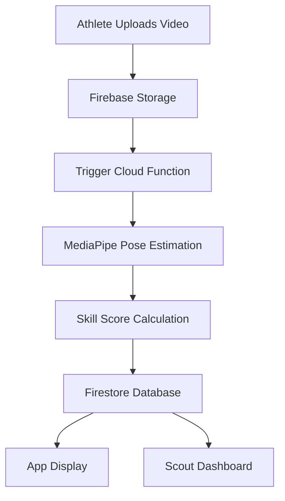

# Khel-Connect: Requirements Document  

---

## Table of Contents
- [1. Introduction](#1-introduction)  
- [2. Functional Requirements](#2-functional-requirements)  
  - [2.1 Athlete Mobile App](#21-athlete-mobile-app)  
  - [2.2 Scout Dashboard](#22-scout-dashboard)  
- [3. Technical Requirements](#3-technical-requirements)  
- [4. Non-Functional Requirements](#4-non-functional-requirements)  
- [5. Use Cases](#5-use-cases)  
- [6. Feature Prioritization](#6-feature-prioritization)  
- [7. Constraints](#7-constraints)  
- [8. Glossary](#8-glossary)  
- [9. Requirements Traceability Matrix (RTM)](#9-requirements-traceability-matrix-rtm)  
- [10. References & Links](#10-references--links)  

---

## 1. Introduction  

### 1.1 Purpose  
Khel-Connect is a mobile and web-based platform to democratize sports talent identification in India.  
It leverages AI to provide fair, objective, and scalable talent assessment, enabling athletes from any background to be discovered by scouts and authorities.  

### 1.2 Scope  
The MVP focuses on **cricket** and specifically the **bowling action**.  
This validates the core technology and provides a demonstrable prototype for SIH 2025.  

---

## 2. Functional Requirements  

<b>2.1 Athlete Mobile App</b>

**User Stories**  
- Create a profile to showcase skills.  
- Upload short video clips for AI analysis.  
- Receive a Skill Score with performance feedback.  
- Track rankings on leaderboards.  

**Requirements**  
- **Registration & Profile**  
  - User registration with name, email, password.  
  - Profile must include sport (cricket), role (bowler), and location.  

- **Video Upload**  
  - Support MP4 format, ≤ 20 MB, ≤ 15s clips.  
  - Provide progress indicator during upload.  

- **AI Analysis**  
  - Display Skill Score (0–100) within 30 seconds.  
  - Show at least two metrics (e.g., arm angle, swing speed).  

- **Leaderboard**  
  - Dynamic leaderboard based on Skill Scores.  
  - Filterable by location (district/state).  

**Priority**: Must-Have for MVP  
**Acceptance Criteria**: Upload-to-Score cycle < 30s; leaderboard updates < 10s.  

<b>2.2 Scout Dashboard</b>

**User Stories**  
- Log in securely to view top athletes.  
- Access leaderboards based on Skill Scores.  
- View player profiles and analyzed clips.  
- Review AI metrics for each video.  

**Requirements**  
- **Authentication**  
  - Secure login restricted to verified personnel.  
  - Enforce role-based access control.  

- **Dashboard**  
  - Clean leaderboard visualization.  
  - Access to player profiles, videos, and Skill Scores.  

**Priority**: Must-Have for MVP  
**Acceptance Criteria**: Verified scouts only; dashboard loads < 2s.  

---

## 3. Technical Requirements
- **Architecture**: Serverless (Firebase + Google Cloud Functions).  
- **Mobile App**: React Native (Expo).  
- **Backend**: Firebase Auth, Firestore (NoSQL), Firebase Storage.  
- **AI/ML Engine**: Python Cloud Function with MediaPipe + OpenCV.  
- **Dashboard**: React/Vue.js, hosted on Netlify/Vercel.  

### System Data Flow (Mermaid Diagram)

---

## 4. Non-Functional Requirements

- **Usability**  
  - Intuitive UI for athletes and scouts.  

- **Performance**  
  - Process 10-second video in ≤ 30 seconds.  
  - Leaderboard updates within 10 seconds.  

- **Scalability**  
  - Support ≥ 500 concurrent video uploads.  

- **Security**  
  - Encrypted data storage.  
  - Role-based access control.  

- **Reliability**  
  - Handle failed uploads gracefully.  
  - Retry mechanism for AI errors.  

- **Maintainability**  
  - Modular, well-documented code.  

- **Accessibility**  
  - Inclusive design for diverse user groups.  

---

## 5. Use Cases  

### Use Case: Upload and Analyze Video  

| Item          | Description                                    |
|---------------|------------------------------------------------|
| Actor         | Athlete                                        |
| Precondition  | Athlete logged in with completed profile       |
| Trigger       | Athlete uploads a bowling action video         |
| Main Flow     | Upload → AI analysis → Score → Leaderboard     |
| Postcondition | Athlete sees updated Skill Score and ranking   |

---

## 6. Feature Prioritization  

| Feature                  | Priority   | MVP Inclusion |
|---------------------------|------------|---------------|
| Athlete Profile           | Must-Have  | Yes           |
| Video Upload              | Must-Have  | Yes           |
| AI Skill Score Analysis   | Must-Have  | Yes           |
| Leaderboard               | Must-Have  | Yes           |
| Regional Filtering        | Should-Have| Later         |
| Advanced Metrics          | Could-Have | Future        |
| Multi-Sport Expansion     | Future     | No            |

---

## 7. Constraints
- **Platform**: Android ≥ 10, iOS ≥ 14.  
- **Video**: MP4 only, max 15s, ≤ 20 MB.  
- **Network**: Requires active internet connection.  

---

## 8. Glossary
- **Skill Score**: Numeric score (0–100) generated by AI for each video.  
- **Leaderboard**: Ranked list of athletes by Skill Score.  
- **Scout Dashboard**: Web interface for authorities to access athlete data.  
- **MVP**: Minimum Viable Product – cricket bowling action.  

---

## 9. Requirements Traceability Matrix (RTM)  

| Req ID | User Story       | Requirement              | Acceptance Criteria            | Test Case |
|--------|------------------|--------------------------|--------------------------------|-----------|
| FR-1   | Upload clip      | MP4 ≤ 20MB support       | Upload completes within 20s    | TC-01     |
| FR-2   | Get feedback     | AI Skill Score ≤ 30s     | Score displayed on profile     | TC-02     |
| FR-3   | View leaderboard | Display top 10 players   | Updates visible within 10s     | TC-03     |
| FR-4   | Scout login      | Secure role-based access | Only verified scouts can log in| TC-04     |

---

## 10. References & Links
- [Vision Document](./Khel-Connect%20Explanation.docx)  
- [Strategic Plan](./Project%20Khel-Connect.docx)  
- [Repository Documentation](./README.md)  

---

**MVP Focus**: Cricket (Bowling Action)  
**Key Feature**: Live AI analysis with instant Skill Score  
**Architecture**: Secure, scalable, serverless  
