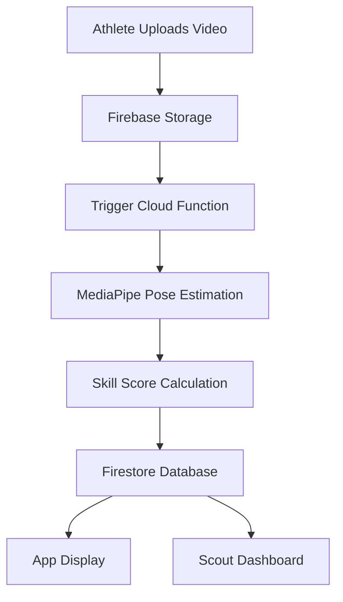

# Khel-Connect: Requirements Document  

---

## At a Glance
- **Purpose**: AI-powered platform to democratize sports talent identification in India.  
- **MVP Focus**: Cricket – Bowling Action Analysis.  
- **Core Features**: Athlete Profile, Video Upload, AI Skill Score, Leaderboards, Scout Dashboard.  
- **Tech Stack**: React Native, Firebase, Cloud Functions, MediaPipe, OpenCV.  
- **Wow Factor**: Real-time AI analysis and Skill Score visible within 30 seconds.  

---

## Table of Contents
- [1. Introduction](#1-introduction)  
- [2. Functional Requirements](#2-functional-requirements)  
- [3. Technical Requirements](#3-technical-requirements)  
- [4. Non-Functional Requirements](#4-non-functional-requirements)  
- [5. Use Cases](#5-use-cases)  
- [6. Feature Prioritization](#6-feature-prioritization)  
- [7. Constraints](#7-constraints)  
- [8. Requirements Traceability Matrix (RTM)](#8-requirements-traceability-matrix-rtm)  
- [9. References & Links](#9-references--links)  

---

## 1. Introduction  

**Purpose**  
Khel-Connect leverages AI to provide a fair, objective, and scalable method of sports talent assessment. It enables athletes from any background to be discovered by scouts and sports authorities.  

**Scope**  
The MVP focuses on cricket, specifically the bowling action, to validate the technology and user experience.  

---

## 2. Functional Requirements  

### Athlete Mobile App  

| Feature          | Requirement                                     | Priority   | Acceptance Criteria            |
|------------------|-------------------------------------------------|------------|--------------------------------|
| Profile          | Create & update athlete profile                 | Must-Have | Profile created successfully   |
| Video Upload     | MP4 ≤ 20MB, ≤15s, with progress indicator       | Must-Have | Upload completes in ≤ 20s      |
| AI Analysis      | Skill Score (0–100) with ≥ 2 key metrics        | Must-Have | Score displayed in ≤ 30s       |
| Leaderboard      | Ranked list, filterable by region               | Must-Have | Updates within ≤ 10s           |

### Scout Dashboard  

| Feature          | Requirement                                     | Priority   | Acceptance Criteria            |
|------------------|-------------------------------------------------|------------|--------------------------------|
| Authentication   | Secure, role-based login for verified scouts    | Must-Have | Only approved scouts can log in|
| Dashboard        | View leaderboards, profiles, and analyzed clips | Must-Have | Loads within ≤ 2s              |

---

## 3. Technical Requirements  

- **Architecture**: Serverless (Firebase + Google Cloud Functions).  
- **Mobile App**: React Native (Expo).  
- **Backend**: Firebase Auth, Firestore, Firebase Storage.  
- **AI/ML Engine**: Python Cloud Function with MediaPipe + OpenCV.  
- **Dashboard**: React/Vue.js, hosted on Netlify/Vercel.  

**System Data Flow**  

---

## 4. Non-Functional Requirements  

View Non-Functional Requirements

| Category      | Requirement                                  |
|---------------|----------------------------------------------|
| Usability     | Intuitive UI for athletes and scouts         |
| Performance   | Process video ≤ 30s; leaderboard ≤ 10s       |
| Scalability   | Handle ≥ 500 concurrent uploads              |
| Security      | Encrypted storage; role-based access         |
| Reliability   | Graceful error handling; retry mechanisms    |
| Maintainability| Modular, well-documented code               |
| Accessibility | Inclusive design for diverse user groups     |

---

## 5. Use Cases  

### Use Case: Upload and Analyze Video  

| Item          | Description                                    |
|---------------|------------------------------------------------|
| Actor         | Athlete                                        |
| Precondition  | Athlete logged in with completed profile       |
| Trigger       | Uploads a bowling action video                 |
| Main Flow     | Upload → AI analysis → Score → Leaderboard     |
| Postcondition | Athlete sees updated Skill Score and ranking   |

---

## 6. Feature Prioritization  

| Feature                  | Priority   | MVP Inclusion |
|---------------------------|------------|---------------|
| Athlete Profile           | Must-Have  | Yes           |
| Video Upload              | Must-Have  | Yes           |
| AI Skill Score Analysis   | Must-Have  | Yes           |
| Leaderboard               | Must-Have  | Yes           |
| Regional Filtering        | Should-Have| Later         |
| Advanced Metrics          | Could-Have | Future        |
| Multi-Sport Expansion     | Future     | No            |

---

## 7. Constraints  

- **Platform**: Android ≥ 10, iOS ≥ 14.  
- **Video**: MP4 only, ≤ 15s, ≤ 20MB.  
- **Network**: Stable internet connection required.  

---

## 8. Requirements Traceability Matrix (RTM)  

| Req ID | User Story       | Requirement              | Acceptance Criteria            | Test Case |
|--------|------------------|--------------------------|--------------------------------|-----------|
| FR-1   | Upload clip      | MP4 ≤ 20MB support       | Upload completes ≤ 20s         | TC-01     |
| FR-2   | Get feedback     | AI Skill Score ≤ 30s     | Score displayed in profile     | TC-02     |
| FR-3   | View leaderboard | Display top 10 players   | Updates visible ≤ 10s          | TC-03     |
| FR-4   | Scout login      | Secure role-based access | Verified scouts only           | TC-04     |

---

## 9. References & Links  
- [Vision Document](./Khel-Connect%20Explanation.docx)  
- [Strategic Plan](./Project%20Khel-Connect.docx)  
- [Repository Documentation](./README.md)  

---

**MVP Focus**: Cricket (Bowling Action)  
**Key Feature**: Real-time AI analysis with instant Skill Score  
**Architecture**: Secure, scalable, serverless  
